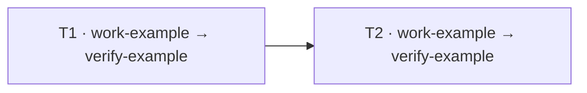

# Work Contracts

<a id="scope"></a>

## 1. Scope

- Apply when the Human requests a work contract, consolidates requests into a task
  list for subsequent execution, or executes an existing contract.
- Main derives the contract from the conversation, attachments and relevant source
  inspection. Required fields are Main's preparation responsibility, not a form the
  Human must fill out. Preserve original requirements and source references.
- A request to organize a list or show a sample does not authorize implementation.
  Preserve the captured execution mode and approval policy; preparing a contract adds
  no routine approval gate under bypass.
- Use file-level change scope for code work. For research or other non-file work,
  identify the actual targets and deliverables without inventing code paths.
- Follow [Document](../../document/SKILL.md) when storing a durable contract; ordinary
  chat samples require no file creation. Contract identity does not itself promote a
  document to an accepted Specification.
- Store a durable contract at `docs/progress/<contract-id>/contract-v<N>.md` with its
  execution record in that file. Keep `progress.md` as the catalog entry and contract
  version index, without duplicating execution results. Keep explicitly linked
  attachments in the same directory. Preserve earlier contract versions and existing
  `progress.md` records.
- Keep the directory contract ID, each filename version and the corresponding metadata
  equal. Link every attachment from a contract version or legacy `progress.md` so catalog
  and search can validate and expose it.

<a id="contract-content"></a>

## 2. Contract content

| Contract section | Required content |
|---|---|
| 계약 정보 | A metadata table with contract ID, positive version, project root and governing specifications |
| 작업 고용 | Planned Agent IDs and roles, including Main, Work and Verification when the selected route uses them |
| 작업 목표 | Stable task IDs, the assigned Agent IDs, work and scope, and observable completion criteria |
| 제약 조건 | A table of important constraints, exclusions and task dependencies, keyed by task ID where applicable |
| 파일 구조 | Exact project-relative paths in a directory tree, with intended add/modify/delete/move operation, task ID and file-specific goal adjacent to each file |
| 작업 순서 | A task-level diagram whose nodes use the same task IDs and whose edges visualize the dependencies recorded in 제약 조건 |

- Keep the document front matter required by Document; the 계약 정보 table is the
  Human-facing identification view and must agree with that front matter.
- Add a separate `<!-- contract-execution-record -->` marker after the six sections,
  followed by an `실행 기록` heading. This is an execution log, not a seventh contract
  section. Include the marker even before the first execution.
- Record each execution under its bound contract version and stable task IDs, with
  workflow/run IDs, actual Agents, Work and Verification status, evidence, timestamps
  and blockers. Keep the execution record distinct from the contract change history.

- Record the project or repository root when needed to resolve paths unambiguously.
- Include governing specifications with path/link, relevant section and version when
  applicable; explicitly distinguish no applicable specification from one not yet found.
- Record dependencies once in the 제약 조건 table. The 작업 순서 diagram derives its
  arrows from those entries and must not introduce unlisted dependencies. Include
  task-specific constraints, preserved behavior and exclusions when applicable.
  Separate governing specifications from optional reference material.
- Reference material, priority and desired schedule are optional; do not invent them.
- A brief file-specific goal is required for every planned file operation; do not
  invent one for a historical row where it was not recorded. Function designs, internal algorithms,
  code-region tracking and detailed diffs are not required contract fields.
- Task IDs link goals, constraints, files, order and results; Agent IDs link hiring,
  goals and diagram nodes. `T1` is an example, not a required
  prefix. Preserve existing IDs and never renumber them merely to change display order.
- Keep task-specific content in the Human-facing contract. Do not copy the common
  execution rules below or explanatory user instructions into every contract.

<a id="execution-rules"></a>

## 3. Common execution rules

- Main owns the execution-record section of the bound
  `docs/progress/<contract-id>/contract-v<N>.md`. Assign its exact modify operation
  across the contract tasks for Main's result reporting.
  Work reports progress and blockers in its result; Verification reports its receipt.
  Neither role must edit the shared record to complete its own task.
- Before announcing a new contract task list, include a structured `contract` object:
  `id`, positive integer `version`, `progress: {path: "docs/progress/<contract-id>/contract-v<N>.md", owner: "main"}`, and
  `fileOperations` entries with `taskIds`, `operation`, `path` and (for moves)
  `destination`. Each task declares `requiredFileOperations` using the same operation
  fields (an empty list for read-only work). Derive these from the inspected contract
  file list. The announcement and submission validators reject out-of-scope required
  operations and worker writes to Main's execution record before launching work.
  Historical accepted snapshots remain immutable; do not retrofit or replace them.
- Historical contracts bound to `progress.md` keep that path and its original
  recording contract. Do not rewrite or migrate their accepted snapshots.
- Work run without a contract creates no `docs/progress/<contract-id>/` and claims no
  `contract-version`. Existing contract-less records use the Document
  [direct-execution record](../../document/references/progress.md#package-and-metadata) form.
- Under bypass, routine reporting within the accepted outcome adds no approval gate.
  A progress bookkeeping omission alone must not block otherwise authorized Work:
  report it to Main and continue independent in-scope work. Never expand destructive,
  external or product scope under this exception.

- Before finalizing file scope, inspect relevant code, specifications, callers and
  dependencies, including needed test, configuration and generated-file changes.
  Mark unresolved paths as unconfirmed; never fabricate confirmed targets.
- Bind execution to the identified contract version and selected task IDs. Reuse
  existing task presentation/submission identities and snapshots; do not create a
  competing task list or silently replace the captured request.
- The executing Agent chooses detailed implementation within the agreed outcomes,
  governing specifications, exact file paths and add/modify/delete operations.
- Treat the file list as the change boundary. Reading relevant files is not permission
  to change them. Preserve unrelated pre-existing and concurrent changes.
- First seek a sound solution within scope. If a listed operation must be omitted or
  changed, or an unlisted file must change, present the reason and revised contract
  before the affected action and obtain explicit Human confirmation. Do not distort
  implementation or make unnecessary edits just to match the list. Continue independent
  authorized tasks while the affected work waits.
- Record confirmed amendments as a new contract version, retaining the original and
  decision evidence. A contract draft alone grants no deletion, publication or other
  additional authority; apply existing action-specific authorization rules.
- At completion, compare actual file operations with the bound version, accounting
  for the starting state; report missing or unexpected changes and task completion
  evidence. Do not call blocked, failed or unchecked work complete.
- Update execution results under the same task IDs without rewriting the six
  contract sections. Revise those sections only in a new contract version.
  Report file-level outcomes and completion criteria; distinguish own checks from
  independent Verification, and retain the selected route's reporting obligations.

<a id="sample"></a>

## 4. Sample contract

- The paths and specification below are illustrative, not inspected project facts.

### 4.1. 계약 정보

| Field | Value |
|---|---|
| Contract ID | `WC-example` |
| Version | 1 |
| Project root | `/example/project` |
| Governing specification | None identified in this example |

### 4.2. 작업 고용

| Agent ID | Role |
|---|---|
| `main-example` | Main: coordination and execution record |
| `work-example` | Work: implement T1 and T2 |
| `verify-example` | Verification: independently check T1 and T2 |

### 4.3. 작업 목표

| Task ID | Agent IDs | Work and boundary | Completion criteria |
|---|---|---|---|
| T1 | `work-example`, `verify-example` | Add task selection | Individual and all-item selection can be set and cleared |
| T2 | `work-example`, `verify-example` | Submit selected tasks | Only selected tasks are submitted; an empty selection does not execute |

### 4.4. 제약 조건

| Task ID | Kind | Constraint or dependency |
|---|---|---|
| T2 | Dependency | T1 must finish before T2 starts |

### 4.5. 파일 구조

```text
Path / tree                    Change  Task ID  File goal
src/
├── ui/
│   └── TaskList.tsx             +/-     T1      Selection controls
├── state/
│   └── taskSelection.ts         +       T1,T2   Selection state
└── actions/
    └── submitTasks.ts           +/-     T2      Submit selected tasks
```

- `+` means add; `-` means delete; `+/-` means modify. A move states source and
  destination explicitly. Each path also appears as an exact file operation in the
  machine-bound file list or attachment.

### 4.6. 작업 순서



<!-- contract-execution-record -->

### 4.7. 실행 기록

- The actual contract file starts this separate section empty and Main records
  bound execution IDs and evidence here as work proceeds.
